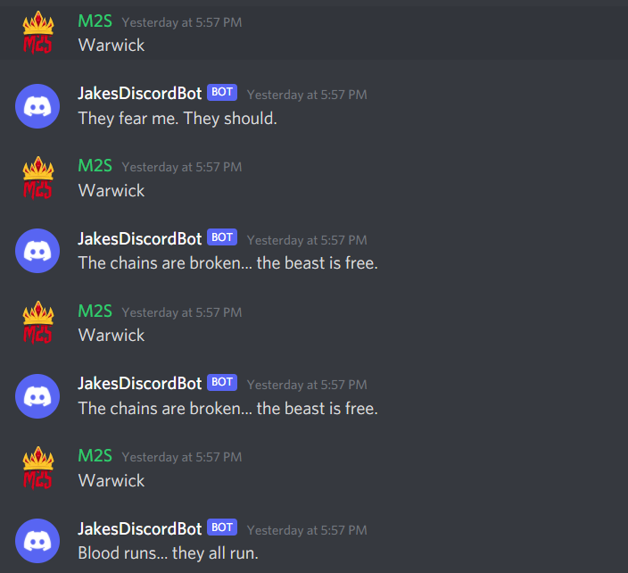

## Setup
* how to get an API token
        * Assuming you have already went into the Discord Developer portal and created your bot. You will then need to go to the left side drop down menu and click the Bot with the puzzle piece figure. You then click the blue add bot button. You can now reveal your api by going into your application for your bot and htting reveal token.

* where to put it to work with the code
        * you want to place your api in a .env file so for example DISCORD_TOKEN=YOURTOKEN.

* dependencies (what packages need to be installed to run the code)
        * You will need to install python-dotenv and discord.py. Can do this by pip3 install -U discord.py and the same for python-dotenv.

## Usage

* with your changes to the code in place, describe
        * I have change the code to use the word Warwick to trigger a message response of Warwicks in game sayings.

* what commands you can type in your Discord server
        * Warwick
* what response this will provide (from your bot)
        * It will provide you with a random line he says in game. For example "Blood runs... they all run."

## Resarch

* you may have realized that it is lame that it only runs when you run the program.
In the real world, things are "always on", not waiting for Bob to turn his PC on and make sure the program is running.
Research some possible solutions that would solve this, and discuss why you think it would work.
        * I would say the best solution would be to use the Cloud to run your bot. There are tons of cloud services avaliable for remote hosting. This would keep your bot up and running 24/7.
		

## Screen shot 

